# Simple Twitter (Frontend repo)
Simple twitter created through Create React App. This is an project developed as part of Alpha Camp's third-semester frontend curriculum. It serves as a capstone project to showcase the skills acquired in JSX, components, Sass, etc. The final version of this project was completed in September 2023.

# Features
### As a user, you can perform various actions after registering:
> * Browse other people's tweets.
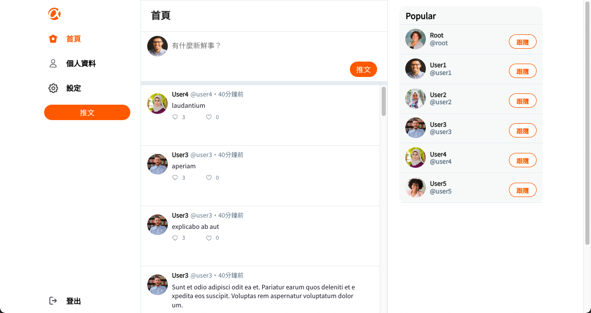
> * Follow other accounts.
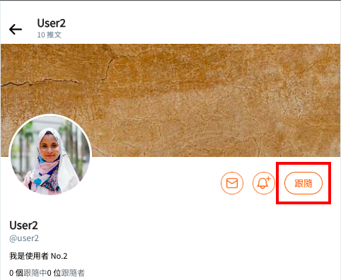
> * Post tweets.
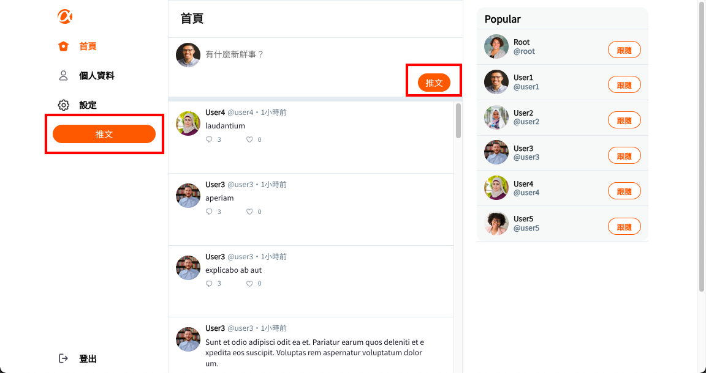
> * Reply to other users' tweets.
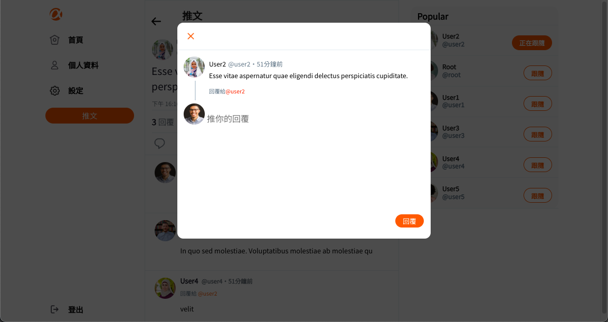
> * View a specific tweet and its replies.
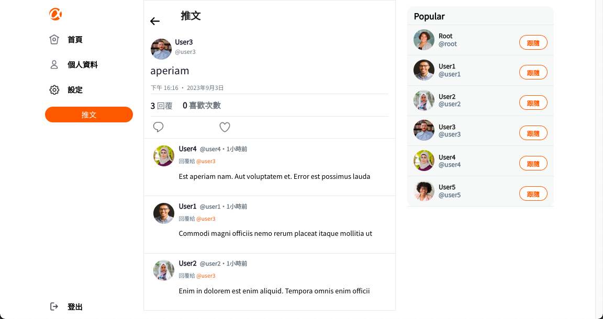
> * Access your own tweets.

> * See the tweets you've replied to.
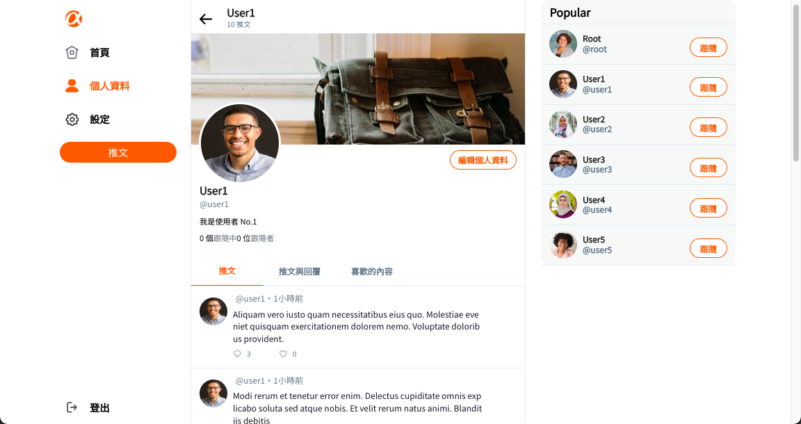
> * Check your liked tweets.
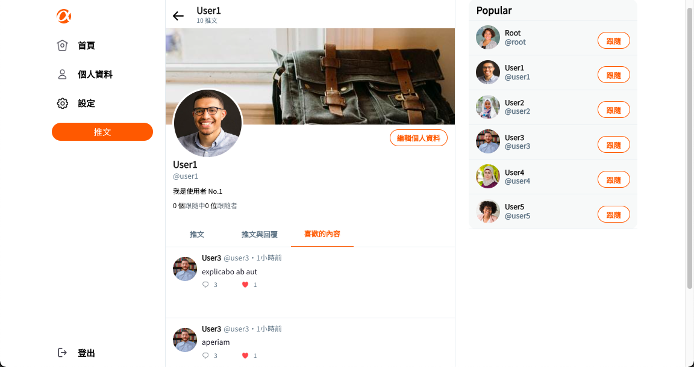
> * Edit your profile information, including name, introduction, avatar, and banner.
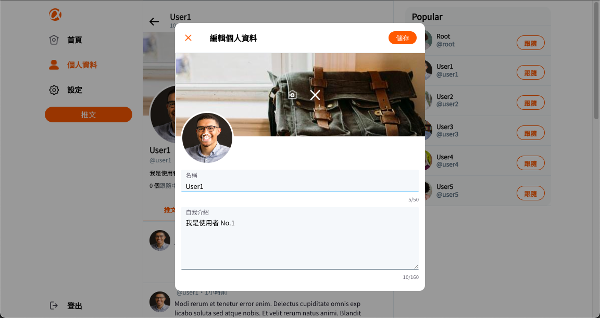
> * View your followers and the users you're following.


### As an administrator, you have additional capabilities:
> * Browse all user information, including total tweets, likes received, followings, and followers.
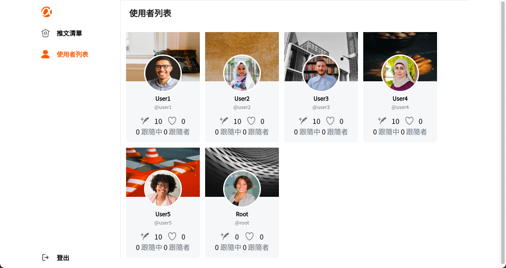
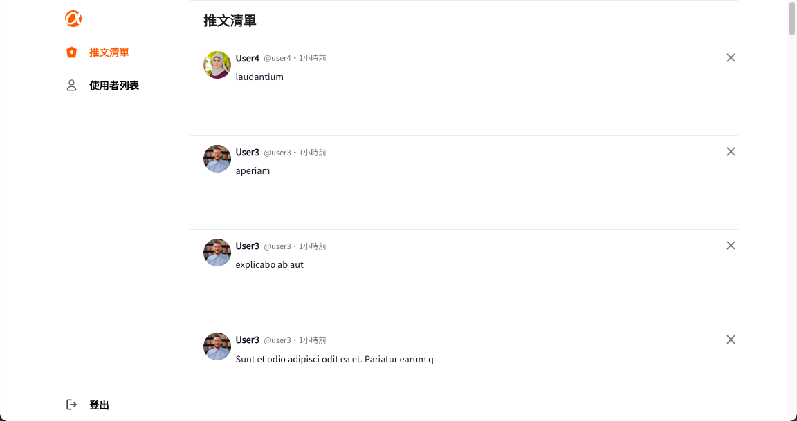
> * Browse all tweets and delete them if necessary, with a confirmation prompt.
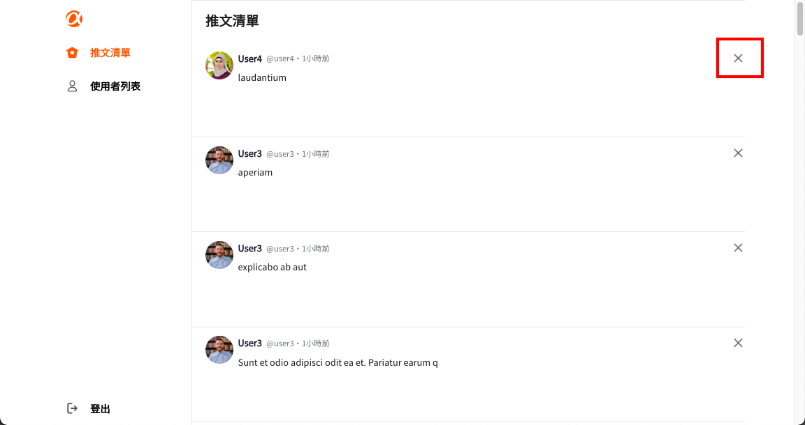

# Test Accounts
### User Account:
> **account:** user1<br>
> **email:** user1@example.com<br>
> **password:** 12345678
### Administrator Account:
> **account:** root<br>
> **email:** root@example.com<br>
> **password:** 12345678

# Project Installation and Launch
1. open your terminal, and clone the project:
```
git clone https://github.com/James-Lee-01/simple-twitter.git
```
2. Navigate to the "simple-twitter" directory and run the following command to install dependencies:
```
npm install
```
3. Start the Project
```
npm start
```

# Development Environment
* Node.js 14.21.
* React 18.2.0
* Sass 1.26.7
* axios 0.27.2
* clsx 1.2.1
* jsonwebtoken 8.5.1